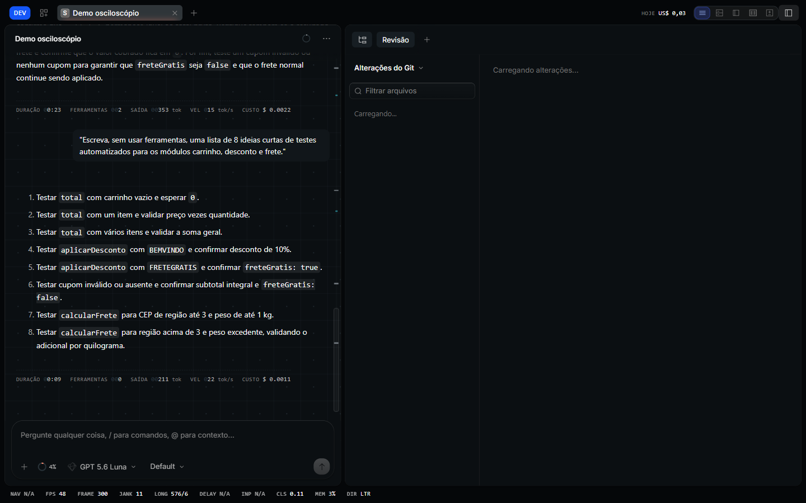

<h1 align="center">Meu OpenCode</h1>

<p align="center">Minha versão do <a href="https://github.com/anomalyco/opencode">OpenCode</a>: visual de osciloscópio, medições ao vivo enquanto a IA responde e um app de desktop que se atualiza sozinho a partir deste código.</p>



> [!NOTE]
> Projeto pessoal, para meu próprio uso. **Não é feito pela equipe do OpenCode e não tem ligação com ela.** O OpenCode original está em [anomalyco/opencode](https://github.com/anomalyco/opencode).

## O que mudei

### O visual: osciloscópio de bancada

Cada resposta da IA é tratada como um sinal ao vivo, medido numa tela de instrumento. O chat fica sobre um fundo escuro com uma grade fina, e a moldura ao redor é opaca. As regras completas do visual estão em [packages/app/DESIGN.md](packages/app/DESIGN.md), e a ideia do produto em [packages/app/PRODUCT.md](packages/app/PRODUCT.md).

- **Cor RGB sempre mudando**, mas só no que está ao vivo: a luz em volta do chat enquanto a IA responde, o botão de enviar/parar, a aba ativa. Erros, avisos e edições têm cores fixas.
- **Enquanto a IA responde:** uma luz corre em volta do painel do chat e, quando ela está pensando, aparece uma onda correndo.
- A velocidade da troca de cor, o brilho da resposta e o limite de gasto ficam em **Configurações → Geral**. Com as animações reduzidas no sistema, tudo isso para.

### Funções que adicionei

- **Faixa de medição ao vivo**, acima da caixa de mensagem: tempo, velocidade em tokens/s, etapa atual, número de passos e custo.
- **Resumo de cada resposta**, no fim do turno: duração, ferramentas, arquivos, tokens, velocidade e custo.
- **Minimapa da conversa**, na borda direita: marcas das minhas mensagens, das edições e dos erros; clicar pula para o trecho.
- **Anel de contexto**, na caixa de mensagem: quanto da memória do modelo a conversa já usa, com "Compactar agora" a um clique.
- **Gasto do dia** na barra de título, somando todas as sessões, com limite diário e aviso.
- **Cola de atalhos:** segurar `Ctrl` mostra todos os atalhos disponíveis.
- **Gerador de vídeos na web:** uma ferramenta que a IA pode usar para gerar vídeos, com painel próprio nas configurações.
- **Navegador de verdade:** a IA abre páginas num Chromium próprio, lê o que o JavaScript montou, clica, preenche formulários, tira print e lê o console e a rede. Um painel à direita (botão do globo) mostra o navegador ao vivo, com o cursor da IA se mexendo, e eu também posso navegar e clicar nele.
- **Busca na web para qualquer modelo:** a ferramenta `websearch` deixou de ser exclusiva do provedor oficial e pode ser ligada para qualquer um, inclusive NanoGPT.

### O navegador

A IA tem um navegador próprio. Ele usa o Microsoft Edge (ou o Chrome) que já está instalado, num perfil separado do meu, então não baixa nada e não mexe nas minhas abas. Como o perfil é guardado, dá para entrar num site uma vez e continuar logado nas próximas conversas.

**O painel.** O botão do globo, no topo da sessão, abre o navegador na coluna da direita, como o da revisão e o do terminal. Ele também abre sozinho quando a IA começa a navegar. É um navegador de verdade, não uma imagem:

- tem abas, voltar, avançar, recarregar e barra de endereço (o que não for endereço vira pesquisa);
- dá para clicar, rolar e digitar na página, e o que eu faço vai para o mesmo navegador da IA. Assim eu entro no site, faço login e deixo com ela;
- enquanto o painel está aberto, a IA mostra o cursor dela: ele desliza até o elemento, contorna o alvo e faz a onda do clique, e a legenda embaixo diz o que ela está fazendo ("Clicando em “Entrar”");
- a página se ajusta ao tamanho do painel, e a IA trabalha nesse mesmo tamanho.

Com o painel fechado, a IA age na velocidade máxima, sem cursor nem pausas.

São cinco ferramentas: abrir páginas e abas, ler a página já renderizada, clicar/digitar/preencher, tirar print e ler console e rede. Para clicar, a IA não adivinha coordenadas: a leitura da página numera cada elemento clicável (`ref_12`) e as ações usam esse número.

Fica ligado sozinho quando encontra um navegador na máquina. Para configurar, no `opencode.json`:

```jsonc
{
  "browser": {
    "headless": false,    // abre a janela do navegador para eu assistir
    "profile": "trabalho", // perfis separados guardam logins separados
    "channel": "chrome"    // usar o Chrome em vez do Edge
  },
  "websearch": { "enabled": true } // liga a busca na web em qualquer modelo
}
```

Rodar JavaScript numa página (`browser_inspect` com `evaluate`) sempre pede confirmação, porque o navegador está logado como eu.

### App de desktop pessoal

O **OpenCode Personal** é um app instalado ao lado do OpenCode oficial, compilado a partir desta pasta. Um vigia observa o código, recompila sozinho depois que eu paro de editar e instala quando o app fecha; também dá para clicar em **Atualizar** e depois em **Reiniciar** na barra de título.

```bash
bun script/personal-desktop/update.ts    # compila agora
bun script/personal-desktop/watch.ts     # vigia o código e recompila
bun script/personal-desktop/startup.ts   # liga o vigia junto com o Windows
```

O app pessoal nunca divide pasta, nome de pacote ou cache com o oficial.

### Instalar em outro PC

O código vem daqui, do GitHub. As configurações vêm num arquivo `.ocpack` criptografado com senha: configuração, agentes, skills, chaves de API e logins, as preferências do app e, se eu quiser, o histórico de conversas. Esse arquivo nunca vai para o GitHub.

1. **No PC de sempre:** dois cliques em `script/personal-desktop/Exportar configuracoes.cmd`. Ele pede uma senha e deixa o arquivo na Área de Trabalho. Levo o arquivo por pendrive ou Drive.
2. **No PC novo:** abro o PowerShell (não precisa ser administrador) e rodo:

   ```powershell
   irm https://raw.githubusercontent.com/AcezeraDev/meu-opencode/dev/script/personal-desktop/instalar.ps1 | iex
   ```

   Ele instala o Git e o Bun, baixa o código, pede o arquivo e a senha, compila e instala o app (uns 10 minutos na primeira vez) e abre o Brave na página de extensões. Lá, ligo o "Modo do desenvolvedor", uso "Carregar sem compactação" com a pasta `browser-extension` e coloco a porta e o código que o painel do navegador do app mostra.

Depois disso, o PC novo **segue o GitHub**: a cada 20 minutos, e quando o Windows inicia, ele confere se publiquei algo novo, recompila e instala quando o app fecha. O botão **Atualizar** também puxa de lá. Para publicar o que mudei aqui:

```bash
bun script/personal-desktop/publish.ts "o que mudou"
```

Antes de enviar, ele confere se nenhum arquivo tem uma chave ou login meu, porque este repositório é público.

## Como rodar

```bash
bun install
bun dev            # o agente no terminal
bun dev:web        # o app no navegador
bun dev:desktop    # o app de desktop
```

## Acompanhando o OpenCode oficial

A branch `dev` aqui do meu computador guarda o histórico completo do projeto original e é por ela que eu puxo as novidades:

```bash
git pull origin dev
```

Este repositório recebe só uma foto do código, sem os commits do projeto original. O `publish.ts` faz isto e confere as chaves antes:

```bash
git branch -f pessoal $(git commit-tree "dev^{tree}" -p pessoal -m "o que mudou")
git push meu pessoal:dev
```

## Licença

MIT, igual ao projeto original — veja [LICENSE](LICENSE). O OpenCode é feito pela [Anomaly](https://github.com/anomalyco); o que está aqui são as minhas mudanças em cima dele.
